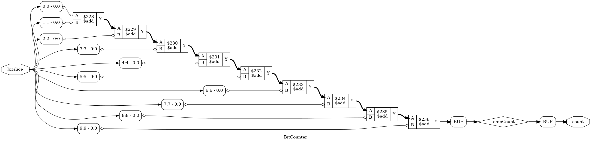

# Contains :

The verilog files used to build the circuits message & pinpad.

NOTE: main.v symlinked to display-main.v, so that we can have a coherent naming pattern when compiling the "circuit helpers"(ie those files)  
See src/circuits_builder/blif_cache.h for details.

New module added LFSR_comb and BitCounter in LFSR_comb.v

### New Circuit Diagrams
#### LFSR_comb for 7 segments

#### BitCounter

#### LFSR_comb for 70 segments

